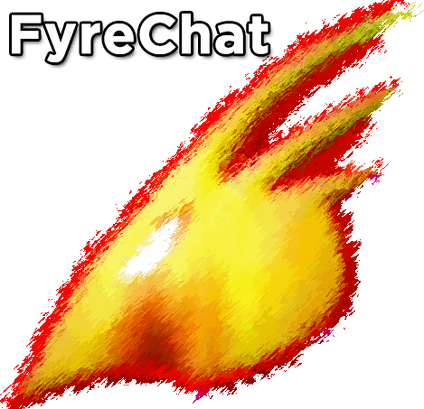
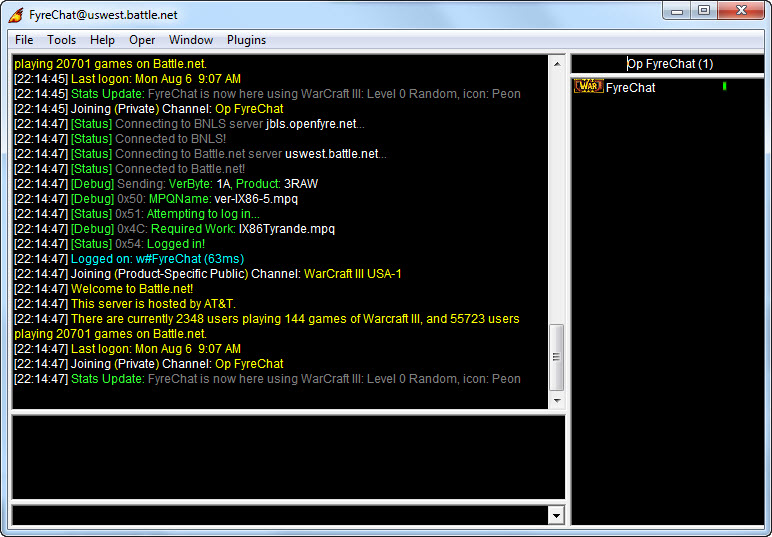
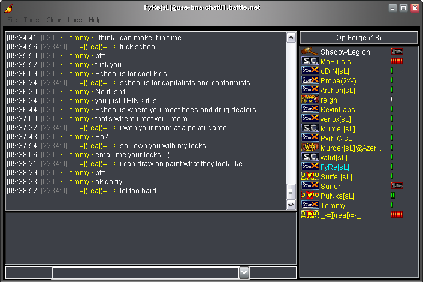
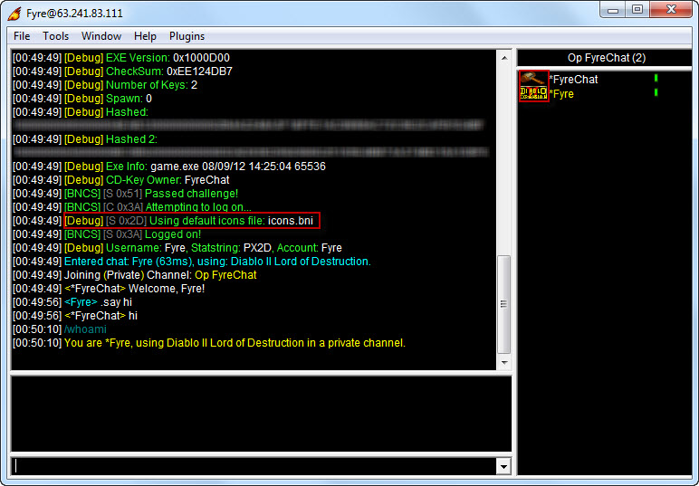
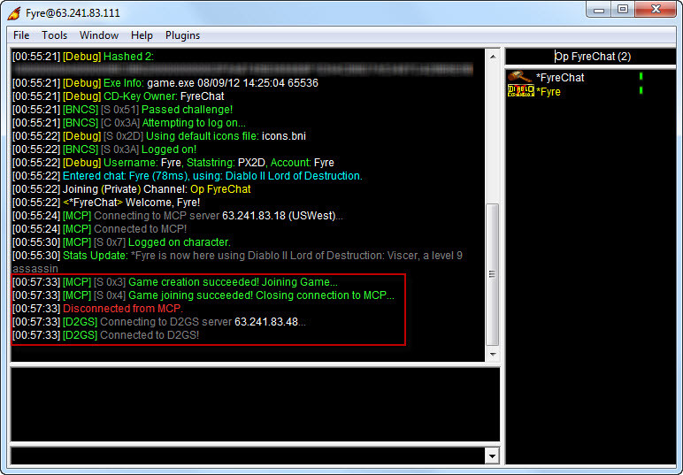
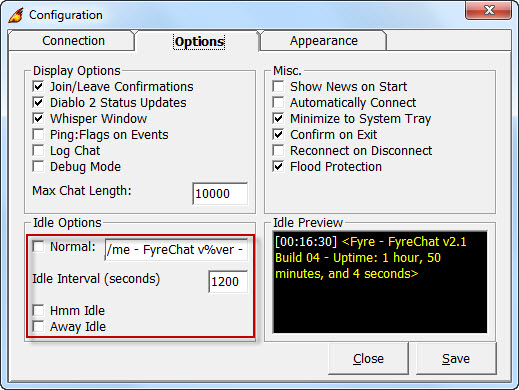
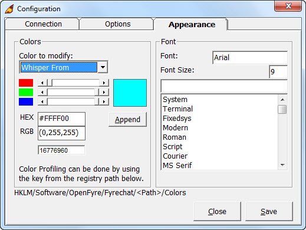

<p align="center">
  
</p>

# FyreChat

A Battle.net chat client developed from FyReBoT source. Emulates a Blizzard client to connect to Battle.net servers with support for multiple games and an extensible plugin system.

## Screenshots

| Main Interface (Warcraft III) | Icon Loading & Channel List |
|:-:|:-:|
|  |  |

| Debug Mode (D2 LOD) | Diablo II Game Creation |
|:-:|:-:|
|  |  |

| Configuration - Options | Configuration - Appearance |
|:-:|:-:|
|  |  |

## Supported Games

| Product | ID | Auth |
|---------|-----|------|
| StarCraft | STAR | Broken SHA-1 |
| StarCraft: Brood War | SEXP | Broken SHA-1 |
| StarCraft Japan | JSTR | Broken SHA-1 |
| StarCraft Shareware | SSHR | Broken SHA-1 |
| Diablo | DRTL | Broken SHA-1 |
| Diablo Shareware | DSHR | Broken SHA-1 |
| Diablo II | D2DV | Broken SHA-1 |
| Diablo II: Lord of Destruction | D2XP | Broken SHA-1 |
| Warcraft II: Battle.net Edition | W2BN | Broken SHA-1 |
| Warcraft III | WAR3 | NLSv2 |
| Warcraft III: The Frozen Throne | W3XP | NLSv2 |

## Features

- **Connection** — BNLS-based authentication with Broken SHA-1 and NLSv2 logon support
- **Icon Loading** — Spoof ping to display -1ms, 0ms, or UDP Plug icons
- **Custom Idle Messages** — Variables for uptime, version, channel, and username
- **Game Support** — Create & join StarCraft and Warcraft II games, manage Diablo II characters and realms
- **Debug Mode** — View BNCS/BNLS/MCP packet IDs and protocol details
- **Appearance** — Customizable fonts, colors, and chat formatting
- **System Tray** — Minimize to tray with status display
- **Flood Protection** — Configurable message queue
- **Logging** — Chat and debug logging
- **Plugins** — 27+ Binary Chat Plugins (BCP) for aliases, bot ops, trivia, Winamp control, and more

## Downloads

Releases are in the `dist/` directory:

| Version | Date |
|---------|------|
| 2.1.09 | August 2012 |
| 2.1.07 | August 2012 |
| 2.0.83 | 2004 |
| 2.0.77 | November 2004 |

## Requirements

- Windows with .NET Framework / VB6 Runtime
- Required VB files (`comdlg32.dll`, `mscomctl.dll`, `msvcp50.dll`, `mswinsck.ocx`, `richtx32.ocx`)
- Visual C++ 7 Runtimes (for plugins)
- A valid Battle.net CDKey for the product you want to connect with

Required runtime files are included in `assets/required_files.zip` and `assets/vc7_crt.zip`.

## Documentation

- [Help & Commands](docs/HELP.md) — Installation, commands reference, idle variables
- [Plugins](docs/PLUGINS.md) — Plugin list with compatibility notes
- [Change Log](docs/CHANGELOG.md) — Full version history
- [BotNet Protocol](docs/BotNetProtocol.txt) — Custom bot network protocol spec
- [BNLS Protocol](docs/BNLSProtocolSpec.txt) — Battle.net Logon Server protocol spec

## Project Structure

```
fyrechat/
├── src/                # VB6 source code (.bas, .cls, .frm)
├── assets/
│   ├── Images/         # Logo, icons, screenshots
│   ├── Plugins/        # BCP plugin files
│   └── *.zip           # Runtime dependencies and archives
├── dist/               # Release builds
├── docs/               # Documentation and protocol specs
└── README.md
```

## License

MIT License. See [LICENSE](LICENSE.md) file.
